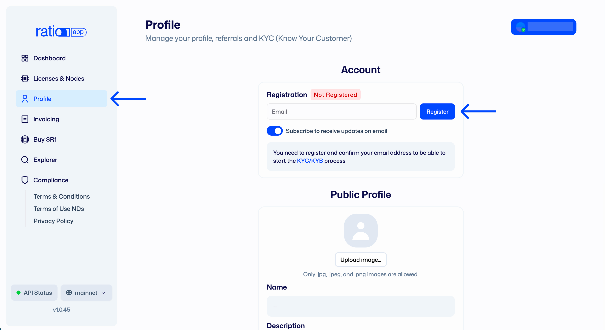
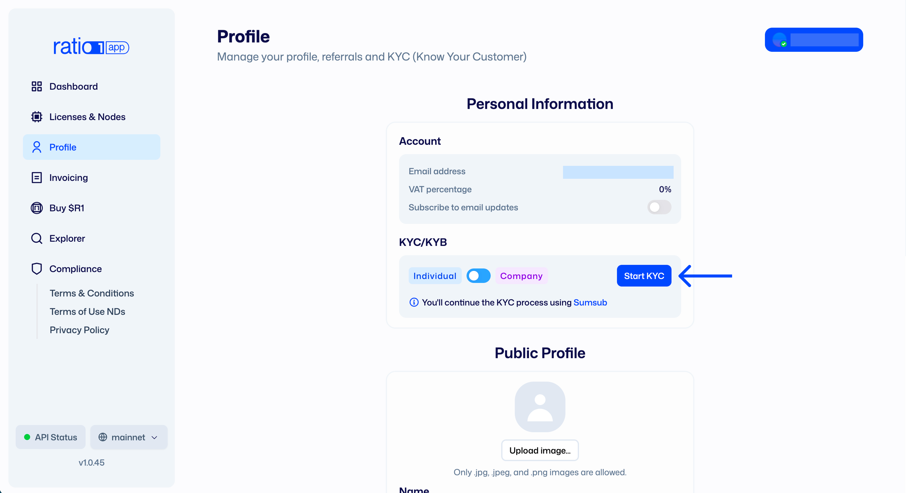
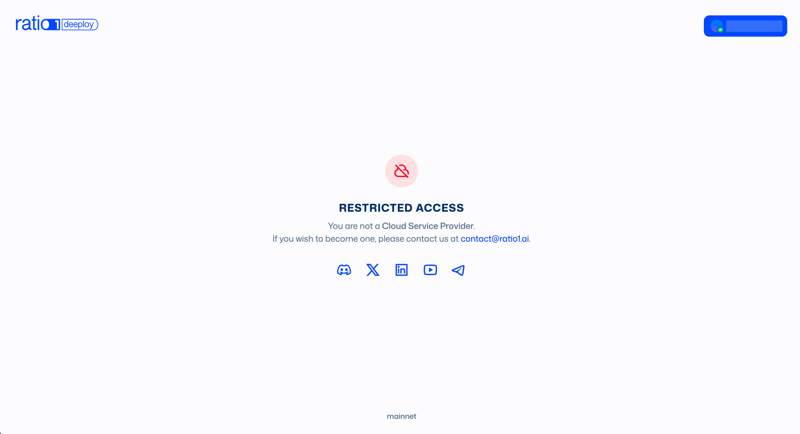
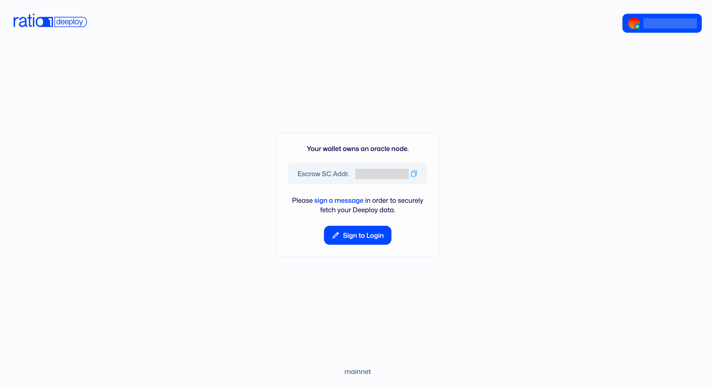
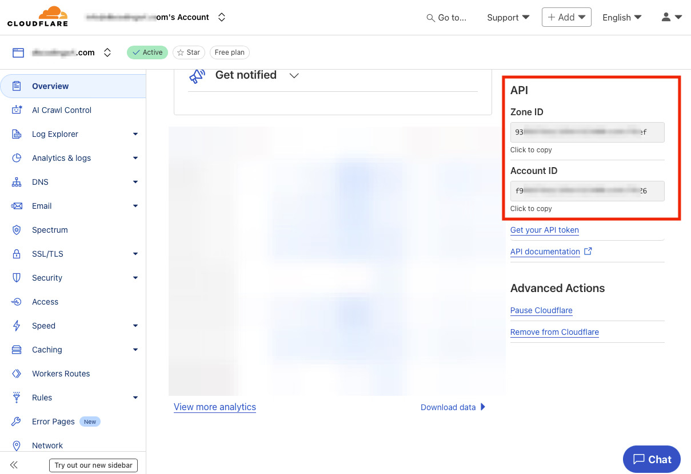
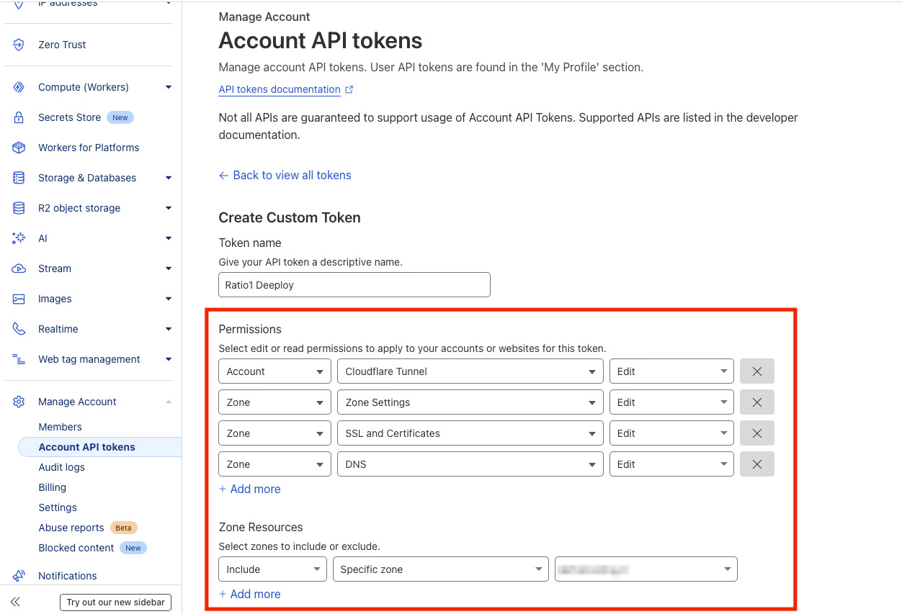
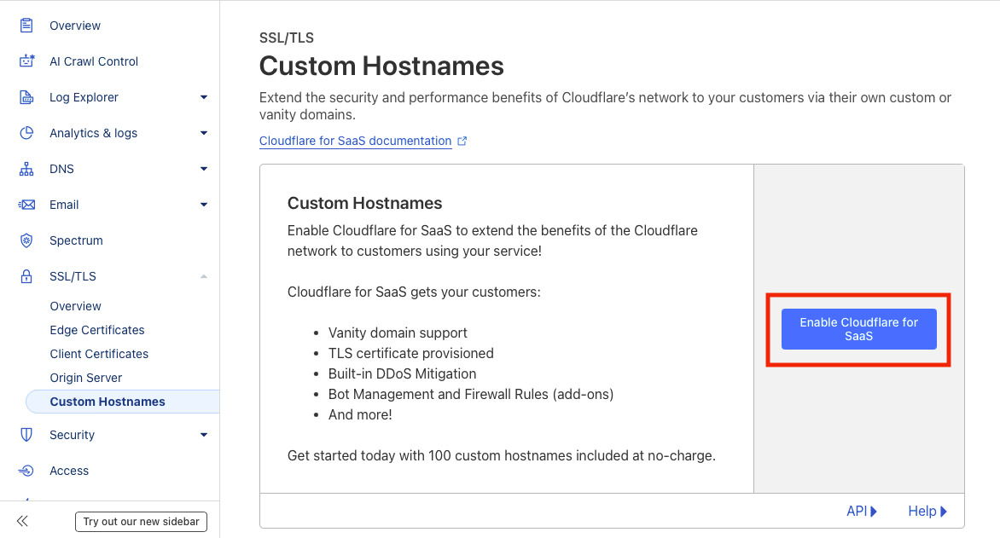
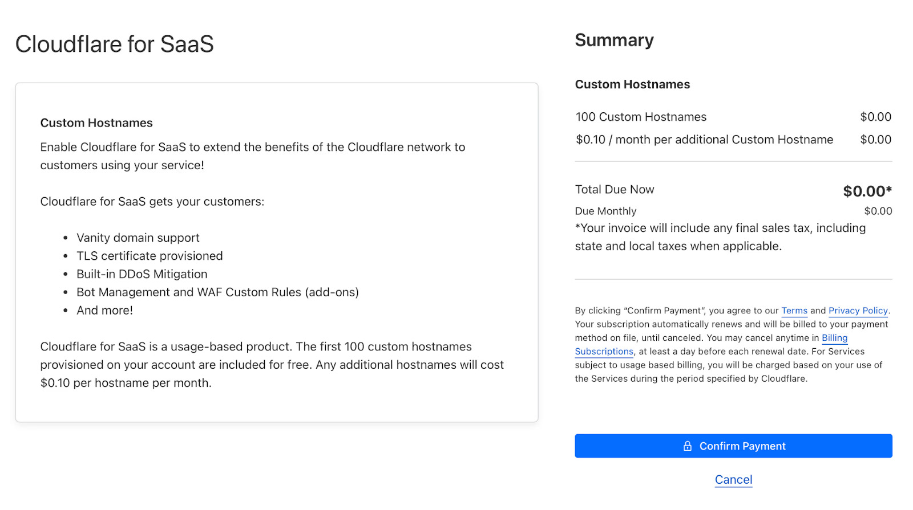

# Deeploy Quick Setup

## What this covers

This page gives you a practical first-run path: onboarding requirements, secrets
setup, first project/job creation, and escrow-backed deployment.

## Prerequisites

Before deploying with Deeploy, confirm:

- You have passed the KYB/KYC process (via **https://app.ratio1.ai/**)
   
  
- You have a licensed oracle node (apply at **contact@ratio1.ai**)

- You have deployed your escrow smart contract instance

- You have set your identity & branding
- Your wallet has enough USDC and Base ETH (for gas fees) to cover deployment
  escrow and runtime costs
- You have a Cloudflare account for tunnel and domain integration

## Step 1: Access Deeploy and prepare your CSP account

1. Open the Deeploy interface and connect your wallet.
2. Ensure your CSP contract and identity prerequisites are complete.

## Step 2: Configure Deeploy Secrets (Cloudflare)

Add the Cloudflare values required by Deeploy:

- `Cloudflare Account ID`
- `Cloudflare Zone ID`
- `Cloudflare API Key`
- `Domain`

### 2.1 Prepare the domain

1. Ensure the domain is connected to and managed by Cloudflare DNS.
2. Decide which zone Deeploy will manage for tunnel-generated subdomains.
3. Deeploy tunnel endpoints are generated as subdomains under that zone (for
   example, `abcdef123456.yourdomain.com`).
4. Recommended: use a dedicated domain for Deeploy workloads to keep app
   subdomains organized.

### 2.2 Find Account ID, Zone ID, and Domain

1. Log in to `dash.cloudflare.com`.
2. Open the target domain (zone).
3. In the zone **Overview** page, locate the **API** section (right side) and
   copy:
   - `Zone ID`
   - `Account ID`
4. Set `Domain` as that zone name (for example, `yourdomain.com`).
5. Paste these values into Deeploy Secrets.

### 2.3 Create the Cloudflare API token (for Deeploy API Key field)

1. In Cloudflare, go to profile -> **Manage Account** ->
   **Account API Tokens** -> **Create Token**.
2. Choose **Create Custom Token** and add these permissions:
   - `Account - Cloudflare Tunnel - Edit`
   - `Zone - Zone Settings - Edit`
   - `Zone - SSL and Certificates - Edit`
   - `Zone - DNS - Edit`
   
3. Scope access to the specific zone when possible (safer default).
4. (Optional) Set token expiration if your security policy requires rotation.
5. Copy the generated token and paste it into Deeploy's
   `Cloudflare API Key` field.

### 2.4 Optional: external domains

If you need to map domains outside your main Deeploy zone/account model, enable
Cloudflare for SaaS on the zone used for Deeploy tunnels (`SSL/TLS` ->
`Custom Hostnames`) and configure linked domains in Deeploy before adding
external CNAMEs.

Cloudflare for SaaS includes the first 100 domains at no extra cost, then
additional domains are billed per Cloudflare pricing.

## 3. Ready for your first deploy

You are now ready to start deploying on Ratio1; continue with [First deploy](./first-deploy).

## Notable date

- Reviewed on **February 23, 2026**.
