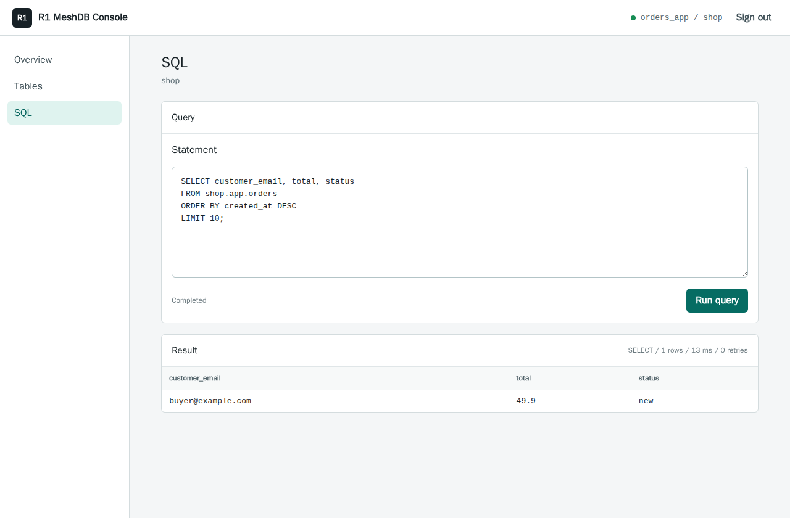

# Use the Dashboard

The **R1 MeshDB Console** is a browser interface for your database. It has three
sections: **Overview**, **Tables**, and **SQL**.

## Sign in

1. Open the running job in Deeploy. In **Deployment**, click **Open R1 MeshDB Console**.
2. Enter the **User** and **Password** chosen when deploying, such as `app_user`
   and its database password. These are not your wallet or Deeploy credentials.
3. Set **Database** to your initial database, such as `appdb`. Replace the console's
   `defaultdb` value if that is not the database you want.
4. Click **Sign in**.

The console uses HTTPS. The CA downloaded from Deeploy is for SQL clients; you
do not need to import it into your browser. Do not bypass browser certificate
warnings: check that you opened the correct console URL.

## Check your database

- **Overview** shows the current database, signed-in user, table count, and engine
  version. Its **Healthy** indicator confirms basic requests succeeded; it is not
  a full replication, quorum, or failover assessment.
- **Tables** lists user-table names and schemas in the selected database. Use
  **Refresh** after creating a table. It is not a row editor; query rows in SQL.
- **SQL** lets you run statements with the permissions of the signed-in user.

## Run your first query

Open **SQL**, replace the contents of **Statement** with this query, and click
**Run query**:

```sql
SELECT current_user AS username, current_database() AS database_name;
```

The result should show your user and selected database. Errors appear above
the editor; successful commands that return no rows show rows affected instead.



Example: querying `shop.app.orders` as `orders_app`, using the sample data and
login created in [the database walkthrough](./databases).

Run **one SQL statement per click**. Do not paste an entire multi-statement
script or `psql` commands such as `\c` into the editor. The console is for short
interactive queries, not bulk imports or long-running migrations.

User/password management (`CREATE USER`, `ALTER USER`) and session/transaction
commands such as `USE` or `BEGIN` are not supported by this console API. A
`disallowed statement type` error is not a missing admin privilege: use a
[SQL client](./databases#3-connect-a-sql-client) for those operations.

:::warning SQL changes are real
`INSERT`, `UPDATE`, `DELETE`, and schema changes act on the live database.
Start with sample data and review each statement before running it.
:::

## Switch databases

Click **Sign out**, then sign back in with the desired **Database** value.
Alternatively, use a fully qualified table name such as `shop.app.orders`
in SQL.

Console requests do not share a persistent SQL session. The examples in the
next guide use fully qualified table names for this reason.

If a table is missing, check the database shown in the header, click Refresh,
and verify the user's permissions. If a session expires, sign in again. Sign
out when finished, especially on a shared computer.

Next: [Create and use databases](./databases).

## Source

- [R1 MeshDB console implementation](https://github.com/Ratio1/r1-meshdb/blob/e638553f899bdc8578afcdc2c3c1e37e1e8163b8/engine/pkg/ui/distoss/assets/bundle.js)
- [Console SQL API statement restrictions](https://github.com/Ratio1/r1-meshdb/blob/e638553f899bdc8578afcdc2c3c1e37e1e8163b8/engine/pkg/server/api_v2_sql.go)
