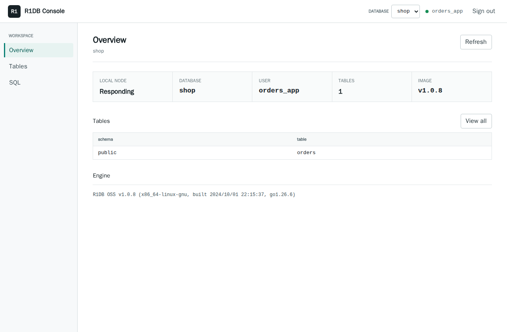
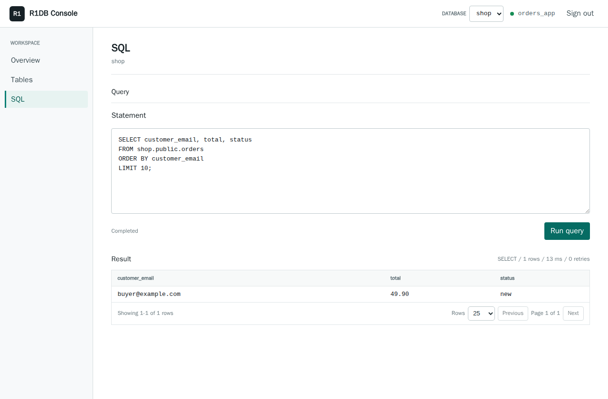

# Use the R1DB Console

The browser console has **Overview**, **Tables**, and **SQL** sections.
Administrators also see **Users** and **Manage**. The configured database
user from a current R1DB deployment has cluster-wide administrator access;
create less-privileged users for applications.

## Sign in

1. Open the running job in Deeploy. In **Deployment**, click **Open R1DB
   Console**.
2. Enter the **User** and **Password** chosen when deploying, such as
   `app_user` and its password. These are not your wallet or Deeploy login.
3. Set **Database** to your initial database, such as `appdb`, if the form
   still shows `defaultdb`.
4. Click **Sign in**.

The console uses HTTPS. The CA downloaded from Deeploy is for SQL clients;
you do not need to import it into your browser. Do not bypass browser
certificate warnings: check that you opened the correct console URL.

## Find your way around

| Section | What it does |
|---|---|
| **Overview** | Shows the selected database, signed-in user, table count, R1DB image version, and engine version. |
| **Tables** | Lists tables in the selected database and opens a **New table** form for supported column types and defaults. |
| **SQL** | Runs one query or data-changing statement at a time and displays its result or error. |
| **Users** | For administrators, shows users and their direct, public, and inherited access; deletion requires confirmation. |
| **Manage** | For authorized users, creates databases and users and grants or revokes focused database or table access. |

**Local node: Responding** on Overview means this console reached its local
database node. It does **not** prove that every cluster node is live, that
every data range has quorum, or that failover works.



Use the **Database** selector in the top bar to switch among databases your
user can access. You no longer need to sign out just to change databases.
If a section is missing, the signed-in user may lack its required permission.

## Run your first query

Open **SQL**, replace **Statement** with the following query, and click
**Run query**:

```sql
SELECT current_user AS username, current_database() AS database_name;
```

The result should show your user and selected database. Errors appear above
the editor; successful commands that return no rows show rows affected.



The sample result is from [the database walkthrough](./databases), signed in
as a limited `orders_app` user.

Run **one statement per click**. Do not paste a multi-statement script or
`psql` commands such as `\c` into the editor. It is for short interactive
queries and data changes, not bulk imports or long-running migrations.

The SQL API rejects schema and transaction-control statements such as
`CREATE DATABASE`, `CREATE TABLE`, `CREATE USER`, `USE`, and `BEGIN`.
Use **Manage** or **Tables** for their supported creation flows, or use a
[SQL client](./databases#connect-a-sql-client) for more advanced SQL.
A `disallowed statement type` error is not necessarily a missing privilege.

:::warning Changes are real
`INSERT`, `UPDATE`, and `DELETE` act on the live database. Review each
statement before running it.
:::

Console requests do not share a persistent SQL session. Select the intended
database in the top bar or use fully qualified table names such as
`shop.public.orders`.

If a table is missing, check the selected database and click **Refresh** in
Tables. If the API session expires, sign in again. Sign out when finished,
especially on a shared computer.

Next: [Create and use databases](./databases).

## Sources

- [R1DB console implementation](https://github.com/Ratio1/r1db/blob/c057e55a1c42b7edecc1d4b23ce87b839a1d3a0c/engine/pkg/ui/distoss/assets/bundle.js)
- [Console management API](https://github.com/Ratio1/r1db/blob/c057e55a1c42b7edecc1d4b23ce87b839a1d3a0c/engine/pkg/server/api_v2_r1db.go)
- [Generic SQL API restrictions](https://github.com/Ratio1/r1db/blob/c057e55a1c42b7edecc1d4b23ce87b839a1d3a0c/engine/pkg/server/api_v2_sql.go)
