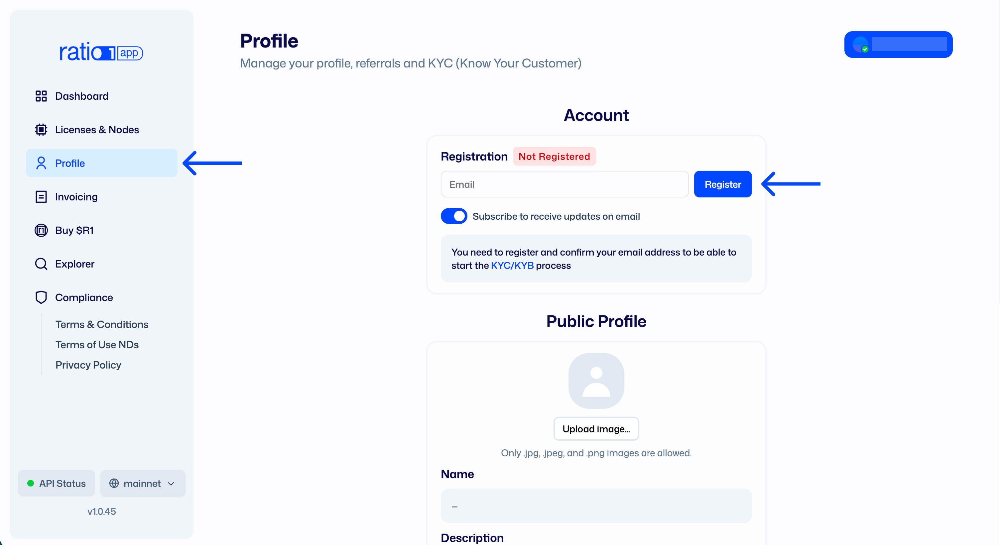
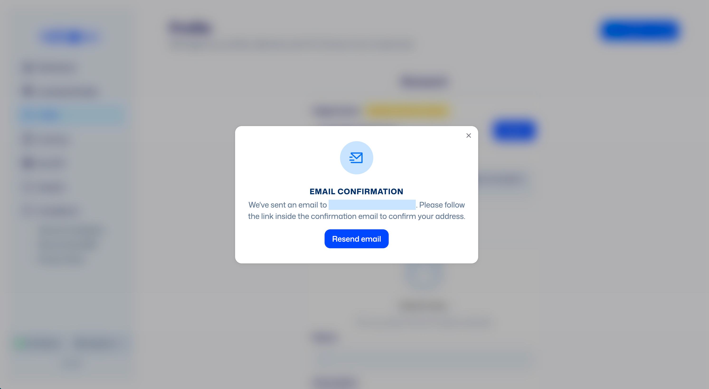
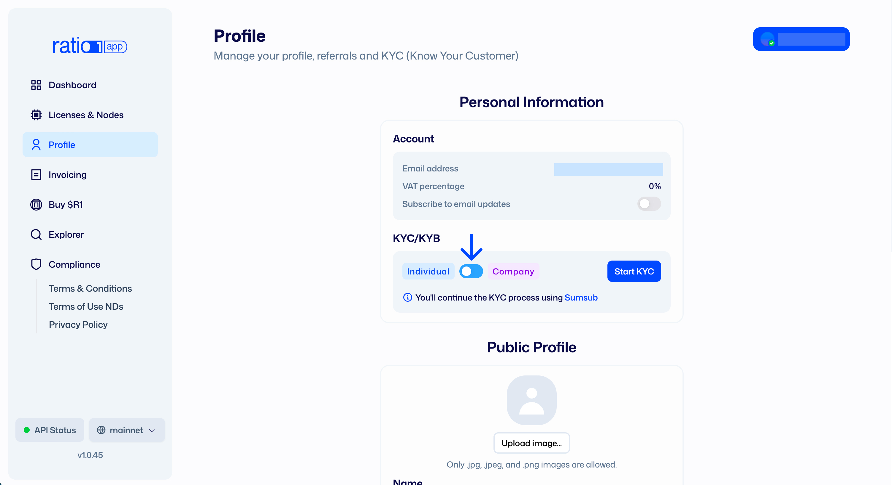
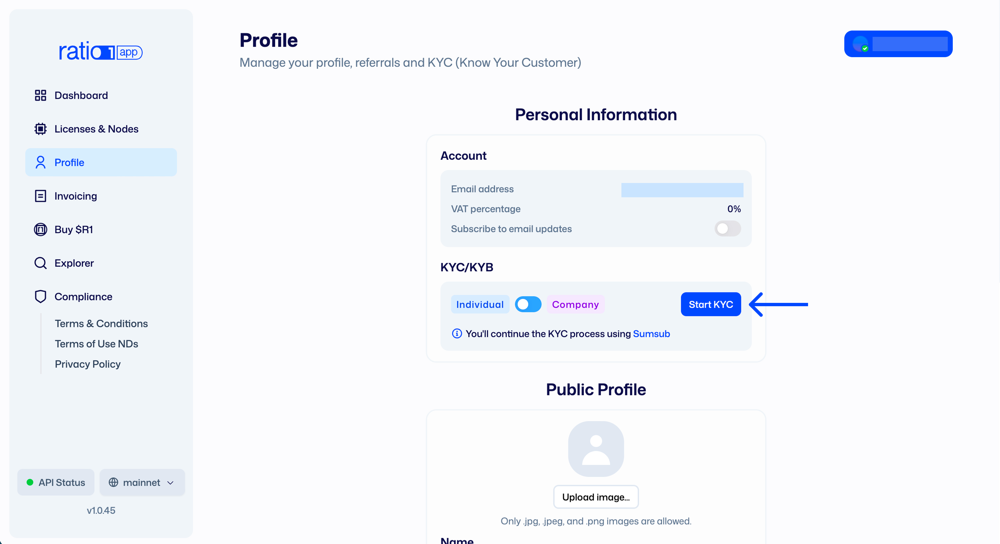
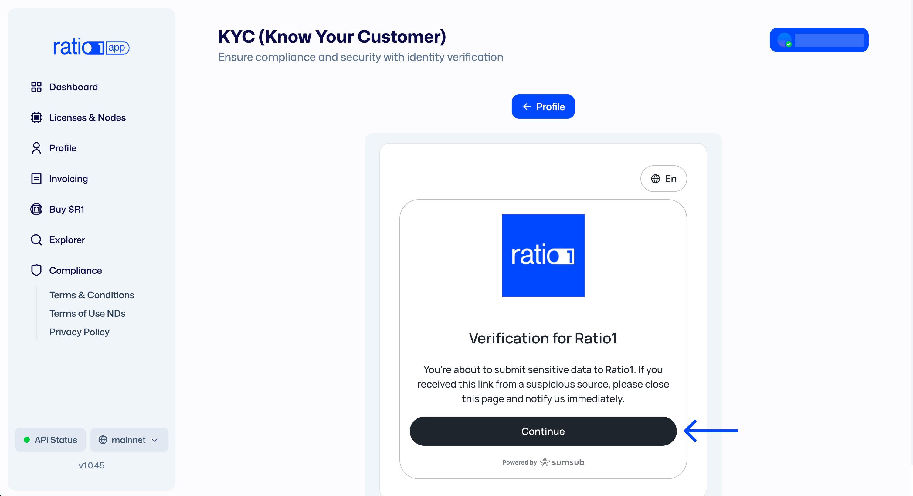

# Buying your first Ratio1 license

Before you can operate a node, purchase a license, or deploy workloads on Ratio1
Mainnet, you must complete **email registration and KYC/KYB verification** for
your wallet. This step is intentional and foundational to how the Ratio1
protocol balances decentralization with real-world reliability, security, and
compliance.

Unlike fully permissionless networks, Ratio1 follows a **permissioned entry,
trustless operation** model. Participation requires identity verification and
license ownership, but once onboarded, all computation, orchestration, and
rewards are enforced by cryptography, smart contracts, and distributed
consensus - not by a central authority.

---

## TL;DR

Ratio1 is not permissionless by design. Entry is gated through **email
registration, KYC/KYB, and license ownership** to ensure accountability, data
safety, and network integrity - while all ongoing operations remain trustless
and decentralized.

---

## What this covers

- Why Ratio1 requires email registration and KYC/KYB
- The difference between _permissionless_ and _trustless_ systems
- How Node Deeds act as onchain licenses for verified participants
- How to complete email registration and KYC/KYB
- What verification enables once you’re inside the protocol

---

## Permissioned entry, trustless execution

In permissionless networks, anyone can join anonymously. While this maximizes
openness, it introduces risks for decentralized AI workloads: unreliable nodes,
regulatory exposure, data misuse, and incentive gaming.

Ratio1 takes a different approach. All node operators and service participants
are verified upfront and operate under an onchain license (Node Deed). This
creates a network of **known, accountable operators** - similar to licensed
providers rather than anonymous actors.

Once verified, trust is no longer placed in individuals or a central company.
Instead:

- Node availability is verified by decentralized oracles
- Rewards are issued automatically via Proof-of-Availability and Proof-of-AI
- Jobs, payments, and state transitions are enforced by smart contracts
- No single entity can override execution or seize workloads

In short: **identity is permissioned - execution is trustless**.

---

## Email registration & KYC/KYB process

Email registration and KYC/KYB are required **once per wallet** on Mainnet and
are mandatory for:

- Purchasing Node Deed (ND) licenses
- Operating Ratio1 Edge Nodes
- Receiving rewards and invoices

### Step 1: Connect your wallet

1. Go to the Ratio1 Mainnet dApp:  
   **https://app.ratio1.ai**
2. Connect your wallet (e.g. MetaMask)

---

### Step 2: Register your email

1. Navigate to **Profile & KYC** 
2. Register an email address linked to your wallet
   
3. Confirm the email via the verification link sent to your inbox

Your email is used for:

- KYC/KYB status updates
- License purchase invoices
- Protocol updates and node-running notifications (recommended)

---

### Step 3: Complete KYC or KYB

1. Choose how you want to participate:
   - **Individual** → KYC
   - **Company** → KYB 
     
2. Complete the verification form (powered by Sumsub)
   
3. Submit the required information and documents

If the information is correct, approval is typically fast. If anything needs
correction, you’ll be notified by email.

**Once approved, your wallet is fully enabled for Mainnet participation.**

## Why this matters

This model enables Ratio1 to support real production workloads, including AI
systems handling sensitive or regulated data. It also makes the network more
resilient, auditable, and legally viable than purely permissionless
alternatives.

Think of Ratio1 compute providers not as anonymous miners, but as **licensed
operators in a decentralized infrastructure** - coordinated by protocol rules
instead of contracts, accounts, or centralized cloud providers.

---

## Next steps

- Complete email registration and KYC/KYB
- Acquire your first Node Deed license
- Return to [Getting Started with the main Dashboard](../)
