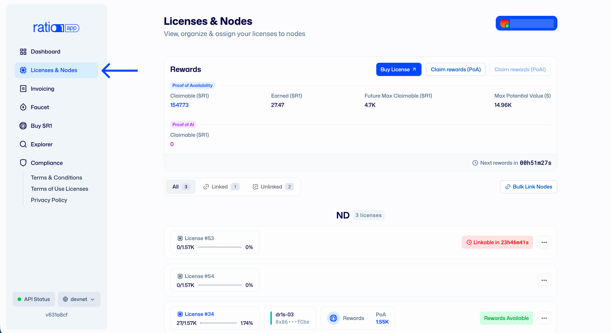
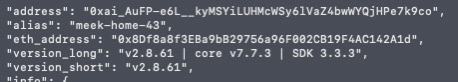
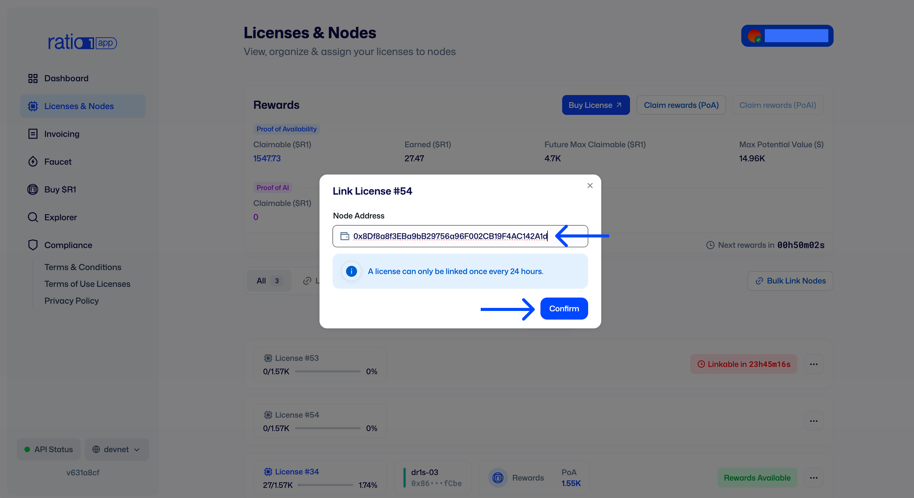
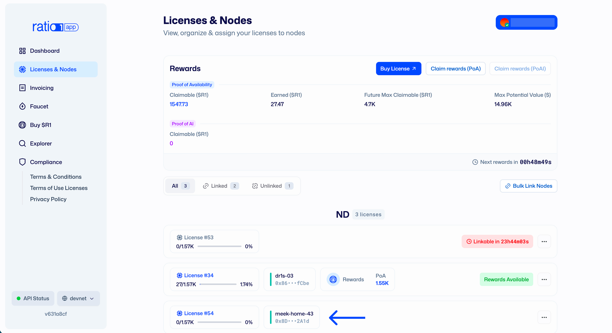

# Linking/Unlinking your Edge Node

## What this covers

- What must be ready before linking
- Why a linked license is required for network participation
- How to link a license to your node ETH address in the app
- How to change the linked node ETH address in the app
- How to unlink a node from a license in the app

---

## Before you link

Before linking a license, make sure you:

1. Installed and started an Edge Node.
2. Have the node's ETH address available.
3. Own a Ratio1 license in your wallet.

Install guide:

- [Node Launcher Quick Setup](../node-launcher/node-launcher-quick-setup)

---

## Why linking is required

A running node is not enough by itself.  
For a node to be allowed to participate in the Ratio1 network, it must have a
License linked to its ETH address.

---

## Link your license to your node

1. Open `app.ratio1.ai` and connect the wallet that owns your license.
2. Go to **Licenses & Nodes**. 
3. Find the license you want to use.
4. Open the license menu and select **Link**. 
5. Paste the node's ETH address.  
     
   
6. Confirm and sign the transaction in your wallet.

After the transaction is confirmed, that license is linked to the node address
you provided. 

---

## Unlink your node from your license

1. Open the license menu and select **Unlink**.
2. Confirm unlinking.
3. Sign the transaction in your wallet.

After confirmation, the node is unlinked from that license.

## Change node

1. Open the license menu and select **Change node**.
2. Fill in the new node ETH address.
3. Confirm the change.
4. Sign the transaction in your wallet.

After confirmation, the license is linked to the new node.

:::note Cooldown after unlinking 
Once a node is unlinked or chaned with another one, a **24-hour cooldown**
period applies before another node can be linked to that license. 
:::

:::warning Claim rewards first 
Claim your rewards before you unlink or change a node.
:::

---

## Notable date

- Reviewed on **February 18, 2026**.
