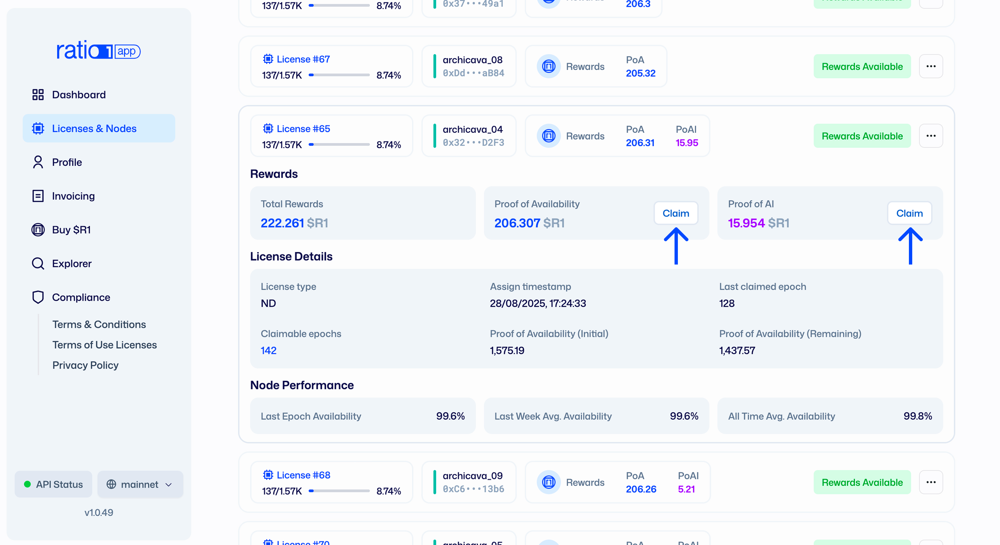
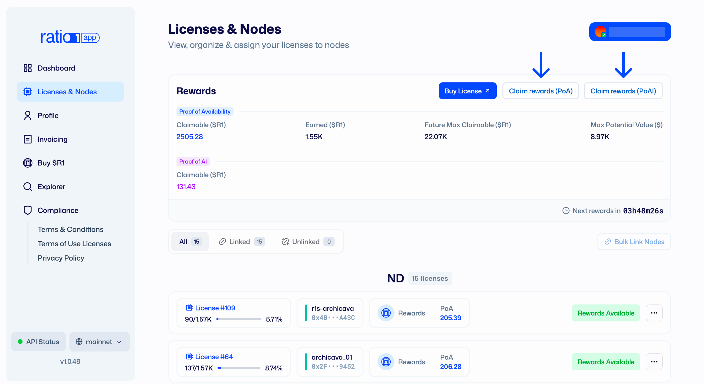

# Rewards Understanding and Claiming

## What this covers

- The two reward types for node operators: **PoA** and **PoAI**
- How rewards are allocated every epoch (**24 hours**)
- How oracle verification and reward claiming work in practice

---

## Reward model overview

To earn rewards, your node must be linked to a valid Node Deed license and
actively participate in the protocol.

In Ratio1, rewards are allocated by epoch:

- **1 epoch = 24 hours**
- Both **Proof of Availability (PoA)** and **Proof of AI (PoAI)** are allocated
  each epoch based on oracle-verified node activity

---

## Reward types

### Proof of Availability (PoA)

**PoA** represents capped protocol rewards for node availability and uptime.

- It rewards operators for keeping nodes online and reachable
- Allocation is epoch-based (every 24 hours)
- Rewards depend on verified availability during that epoch
- PoA rewards are minted at the time of claiming

### Proof of AI (PoAI)

**PoAI** represents rewards from compute jobs executed on your node.

- It rewards operators for real workload execution
- Allocation is epoch-based (every 24 hours)
- Rewards depend on verified job execution in that epoch
- PoAI rewards are paid by Cloud Service Providers (CSPs) through escrow smart
  contracts funded when jobs are deployed

---

## How epoch allocation works

1. Your node reports uptime and executes jobs during the epoch.
2. Oracles verify node availability and job execution data.
3. Oracles allocate PoA and PoAI rewards for that epoch.
4. PoA becomes claimable and is minted when claimed; PoAI is paid from
   CSP-funded escrow contracts based on verified execution.

In short: oracles are the verification layer that confirms real node
contribution before rewards are allocated.

---

## Claim your rewards

1. Open `app.ratio1.ai` and connect the wallet that owns the license.
2. Go to **Licenses & Nodes**.
3. Select the eligible linked license(s).
4. Click **Claim rewards** under PoA & PoAI. Alternatively, you can claim PoA
   and PoAI rewards from all your running nodes using the top dashboard on the
   Licenses & Nodes page.
   
   
5. Confirm and sign the transaction in your wallet.

After confirmation, claimed rewards are minted (PoA)/transferred (PoAI) to
your wallet according to protocol rules.

---

## Notable date

- Reviewed on **February 18, 2026**.
